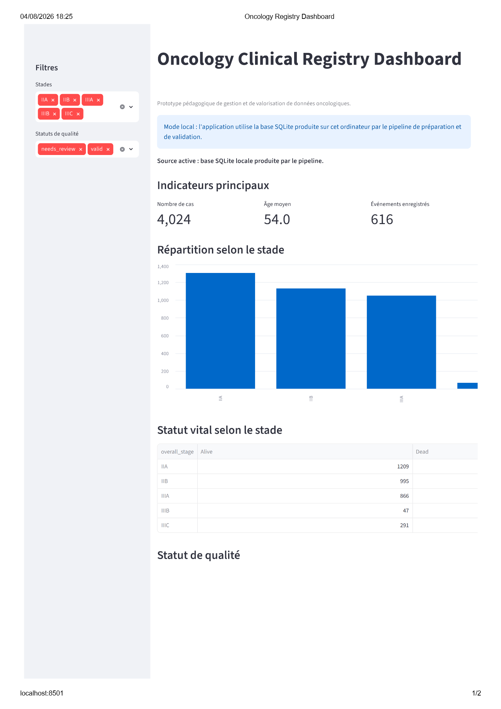
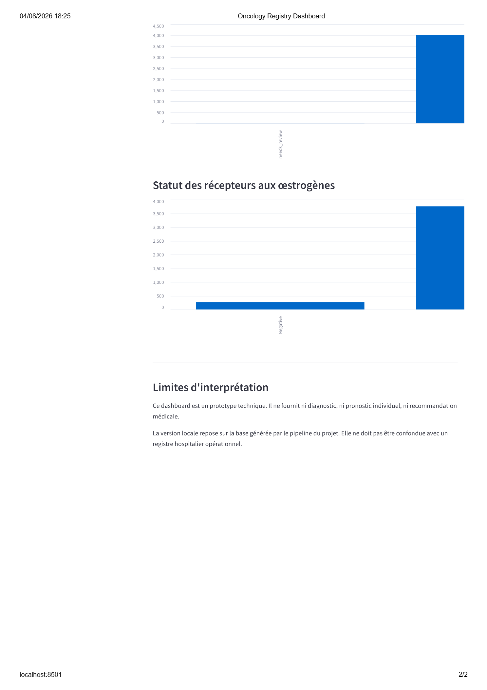

# Oncology Clinical Registry Analytics

## 1. Project overview

This project reproduces, for educational and portfolio purposes,
a clinical oncology registry data-management pipeline.

It demonstrates:

- reproducible data preparation;
- technical data quality validation;
- SQL-based analytical indicators;
- descriptive and survival analyses;
- automated reporting;
- testing and traceability.

The project uses public data and is not intended for clinical
decision-making or individual patient prediction.

## 2. Public health and clinical context

Reliable oncology data are essential for monitoring clinical
activity, describing patient populations, supporting research and
improving the quality of care.

Clinical registry data may originate from several sources, including
electronic health records, multidisciplinary oncology meetings and
national cancer registries. Before these data can be analysed, they
must be structured, checked, documented and made traceable.

This portfolio project simulates part of that workflow using a public
breast-cancer dataset. It focuses on technical data management,
quality control, analytical reproducibility and the production of
aggregated indicators.

The project is educational. It is not an official hospital registry
and must not be used for individual clinical decision-making.

## 3. Professional objectives

The project aims to demonstrate the following professional
competencies:

- document the origin, version and permitted use of a public dataset;
- preserve the original source file without manual modification;
- profile the structure and initial quality of clinical data;
- standardize variable names and data types with Python;
- define reproducible data quality rules;
- identify missing, duplicated, invalid or inconsistent values;
- maintain traceability between raw, prepared and validated data;
- structure validated data in a relational SQLite database;
- produce oncology-related indicators with SQL;
- perform descriptive and survival analyses;
- create aggregated dashboards and reports;
- test the main transformation and validation rules automatically;
- document methodological, ethical and privacy limitations.

## 4. Data source

The project uses the public dataset titled **SEER Breast Cancer Data**.

| Metadata | Information |
|---|---|
| Kaggle identifier | `sujithmandala/seer-breast-cancer-data` |
| Kaggle version | Version 1 |
| Kaggle uploader | Sujith K Mandala |
| Original cited author | Jing Teng |
| Original institutional source | National Cancer Institute — SEER Program |
| SEER release mentioned | November 2017 |
| DOI | `10.21227/a9qy-ph35` |
| License displayed by Kaggle | CC BY 4.0 |
| File format | CSV |
| Number of variables reported | 16 |

The original row-level CSV is stored locally in `data/raw` and is not
distributed through this GitHub repository.

The repository contains the code, documentation, aggregated outputs
and reproducible processing instructions, but not a copy of the
original individual-level dataset.

Detailed provenance information is available in
[`docs/data_source_register.md`](docs/data_source_register.md).

## 5. Repository architecture

data/raw         Original local data, never modified
data/interim     Prepared and quality-control files
data/processed   Validated analytical data and SQLite database
docs             Data source, quality, methodology and ethics
notebooks        Profiling and clinical analyses
src              Reusable Python pipeline
sql              Database schema and analytical queries
app              Local Streamlit dashboard
tests            Automated tests
outputs          Figures and aggregated reports

## 6. Data pipeline

The project follows a layered and reproducible data-management
workflow.

1. **Source documentation — implemented**

   The dataset name, version, license, provenance and known source
   limitations are documented before processing.

   Detailed source information is available in
   [`docs/data_source_register.md`](docs/data_source_register.md).

2. **Raw data layer — implemented locally**

   The original row-level CSV is stored locally in `data/raw/`.

   The source file is read by the project code but is never modified
   or redistributed through this GitHub repository.

3. **Programmatic data profiling — implemented**

   The preparation and validation scripts examine:

   - the source dimensions and column names;
   - duplicated column names;
   - entirely empty and unnamed columns;
   - expected and unexpected variables;
   - numeric conversion issues;
   - missing required values;
   - duplicated records;
   - categorical domains;
   - numerical ranges;
   - consistency between related variables.

   The current profiling controls are implemented programmatically in
   [`src/prepare_data.py`](src/prepare_data.py) and
   [`src/validate_data.py`](src/validate_data.py).

4. **Preparation layer — implemented**

   [`src/prepare_data.py`](src/prepare_data.py) performs reproducible
   preparation of the source data.

   The implemented transformations include:

   - conversion of column names to `snake_case`;
   - removal of the entirely empty unnamed source column with
     traceability;
   - harmonisation of selected source variable names;
   - validation of the expected source schema;
   - conversion of numerical variables;
   - trimming of categorical values;
   - creation of a technical `case_id`;
   - creation of the survival-event indicator;
   - calculation of the lymph-node ratio;
   - addition of source-file and processing-timestamp metadata.

   The prepared dataset is written locally to:

   ```text
   data/interim/oncology_registry_prepared.csv

## 7. Data quality controls

The project applies reproducible technical data-quality controls across
five dimensions:

- **completeness** — presence of required columns and mandatory values;
- **uniqueness** — identification of exact duplicate records;
- **validity** — verification of accepted categories and numerical
  ranges;
- **consistency** — verification of compatibility between related
  variables;
- **traceability** — recording of detected issues, affected records,
  severity levels and processing outputs.

### Implemented controls

The current validation pipeline verifies that:

- all required analytical columns are present;
- mandatory values are available for age, T stage, N stage, overall
  stage, survival duration and vital status;
- exact duplicate records are identified after excluding technical
  metadata;
- age remains within the accepted technical range of 0 to 120 years;
- tumour size is not negative;
- the number of examined regional nodes is not negative;
- the number of positive regional nodes is not negative;
- the number of positive regional nodes does not exceed the number of
  examined nodes;
- survival duration is not negative;
- vital status is coded as `Alive` or `Dead`;
- `Alive` corresponds to `event = 0`;
- `Dead` corresponds to `event = 1`;
- T-stage values belong to `T1`, `T2`, `T3` or `T4`;
- N-stage values belong to `N1`, `N2` or `N3`;
- estrogen-receptor status is coded as `Positive` or `Negative`;
- progesterone-receptor status is coded as `Positive` or `Negative`.

Each detected issue is recorded with:

- the technical `case_id`;
- the violated rule;
- the affected field;
- the severity level;
- a readable issue description.

The validation pipeline produces:

```text
data/interim/data_quality_issues.csv
data/processed/oncology_registry_validated.csv
outputs/reports/data_quality_summary.md
```

## 8. Relational database and SQL indicators

The validated analytical dataset is loaded into a local SQLite
database.

The relational model separates the main analytical domains into four
tables:

- `patients`;
- `tumors`;
- `outcomes`;
- `data_quality_issues`.

The tables are connected through a technical `case_id`. This
identifier is created for the portfolio workflow and is not a real
medical or hospital patient identifier.

Implemented SQL indicators include:

- total number of registered cases;
- distribution of cases by recorded stage;
- vital status by stage;
- average lymph-node ratio by N stage;
- number of records by quality status;
- number of quality issues by rule and severity.

Project files:

- [`sql/schema.sql`](sql/schema.sql)
- [`sql/analysis_queries.sql`](sql/analysis_queries.sql)
- [`src/build_database.py`](src/build_database.py)
- [`src/check_database.py`](src/check_database.py)

The generated SQLite database is stored locally in
`data/processed/oncology_registry.sqlite` and is not distributed
through GitHub.

## 9. Clinical and survival analyses

The clinical and survival analysis component uses the validated
processed dataset:

`data/processed/oncology_registry_validated.csv`

Records are explicitly filtered to retain only observations with:

`quality_status == "valid"`

The latest validated run included **4,022 patient records**, with:

- **616 observed deaths**;
- **3,406 right-censored observations**;
- **2 records excluded** because their quality status was not valid.

The descriptive analysis covers:

- age;
- tumour size;
- regional nodes examined;
- regional nodes positive;
- recorded cancer stage;
- tumour grade;
- hormone-receptor status;
- survival duration;
- vital status.

Survival outcomes are analysed using the Kaplan–Meier method.
The implemented analyses include:

- an overall Kaplan–Meier survival curve;
- Kaplan–Meier curves stratified by recorded stage;
- confidence intervals and explicit censoring markers;
- numbers-at-risk tables at selected follow-up times;
- a global log-rank test across recorded stages;
- pairwise log-rank comparisons with Holm adjustment for multiple testing.

A primary multivariable Cox proportional-hazards model was fitted
using:

- age;
- recorded overall stage;
- tumour grade.

The explicit reference categories are:

- `IIA` for `overall_stage`;
- `Moderately differentiated; Grade II` for `grade`.

Because the proportional-hazards assumption was not supported for
the oestrogen- and progesterone-receptor variables when they were
initially included as ordinary Cox covariates, a sensitivity model
was also fitted using the same primary covariates while stratifying
the baseline hazard by:

- `estrogen_status`;
- `progesterone_status`.

Both the primary and stratified Cox models converged without recorded
convergence warnings. Statistical tests and graphical Schoenfeld
residual diagnostics did not identify unresolved proportional-hazards
violations in the final models.

The stage-specific results showed progressively higher adjusted
hazards from stage IIB through stage IIIC relative to stage IIA.
However, estimates for relatively small groups, particularly stage
IIIB and Grade IV, are interpreted cautiously because of their wider
confidence intervals.

The project does not use `survival_months` as an ordinary predictor
of vital status, because this would introduce target leakage.

All findings are interpreted as descriptive or associational. They
are not presented as causal effects, individual medical predictions,
or clinical decision-support recommendations.

Generated survival-analysis outputs are stored in:

- `outputs/figures/survival`;
- `outputs/reports/survival`.

## 10. Streamlit dashboard

A functional Streamlit dashboard is available in
`app/streamlit_app.py`.

In local mode, the application reads the validated SQLite database
generated by the project pipeline:

```text
data/processed/oncology_registry.sqlite
```

When the local database is unavailable, or when synthetic demonstration
mode is activated, the application uses fully synthetic data generated
by the project code.

The dashboard currently includes:

- total number of filtered cases;
- average age;
- number of recorded events;
- distribution of cases by stage;
- vital status by stage;
- distribution of quality statuses;
- estrogen receptor status;
- filters by stage and quality status.

The dashboard displays aggregated indicators and does not expose the
original raw dataset or direct identifiers.

To run the application locally from the project root:

```bash
streamlit run app/streamlit_app.py
```

The application is then available at:

```text
http://localhost:8501
```

The local version uses the SQLite database generated by the pipeline.
Any future public deployment must use only fully synthetic data or
appropriately aggregated and non-identifying information.

# Dashboard preview





## 11. Automated reporting

The project generates reproducible reporting outputs automatically with
Python. These outputs include a formatted multi-worksheet Excel workbook,
supporting CSV files and text-based analytical diagnostics.

### Excel workbook

The project generates an aggregated Excel workbook from the validated
dataset and the data-quality issue log.

The workbook is available at:

`outputs/reports/oncology_registry_report.xlsx`

It currently contains the following worksheets:

| Worksheet | Content |
|---|---|
| `Instructions` | Data sources, generation details, definitions, confidentiality notes and interpretation limits |
| `Overview` | Main registry, event and quality indicators |
| `Data_Quality_Summary` | Number and percentage of cases by quality status |
| `Quality_By_Rule` | Aggregated issues by validation rule and severity |
| `Missing_Data` | Number and percentage of missing values by variable |
| `Stage_KPIs` | Aggregated case, event and follow-up indicators by recorded stage |
| `Vital_Status` | Vital-status distribution by recorded stage |
| `Survival_Summary` | Aggregated follow-up, death and censoring indicators |

The Excel report can be regenerated from the project root with:

```bash
python src/generate_excel_report.py
```

The workbook is generated programmatically and is not constructed
manually in Excel.

### Supporting CSV and text outputs

The project also generates machine-readable CSV files and text-based
diagnostics during data preparation, validation and survival analysis.

The main output locations are:

```text
data/interim/
data/processed/
outputs/reports/survival/
```

These supporting outputs include:

- the prepared dataset;
- the data-quality issue log;
- the validated dataset;
- case-identifier validation results;
- survival-analysis sample-flow summaries;
- at-risk counts at selected follow-up times;
- Cox model summaries and performance metrics;
- missing-data diagnostics;
- proportional-hazards diagnostics;
- model warnings and readiness checks.

The CSV and text outputs support traceability, reproducibility and
technical review, while the Excel workbook provides a consolidated
stakeholder-facing report.

### Confidentiality and intended use

The stakeholder-facing Excel workbook contains aggregated information
only. It does not expose the original raw dataset, individual case
records or direct identifiers.

The reporting component is intended to demonstrate:

- Python-based reporting automation;
- data-quality monitoring;
- reproducible production of analytical outputs;
- traceability between validated data and final deliverables;
- communication of results to technical and non-technical stakeholders.

## 12. Automated tests

Automated tests verify that the main data-preparation and validation
rules continue to behave as expected after code modifications.

The current test suite covers:

- conversion of column names to `snake_case`;
- acceptance of a technically valid sample record;
- detection of negative survival durations;
- detection of positive regional nodes exceeding examined nodes;
- consistency between vital status and event coding.

Tests are written with `pytest` and stored in:

```text
tests/test_data_quality.py
```
## 13. Running the project

## 13. Running the project

The project can be executed locally from the repository root.

### Prerequisites

The local workflow requires:

* Python 3.14;
* Git;
* the project dependencies listed in `requirements.txt`;
* one copy of the source CSV stored locally in `data/raw/`.

The original row-level dataset is not distributed through this GitHub
repository.

### Create and activate the Python environment

From the project root, create a virtual environment:

```powershell
python -m venv .venv
```

Activate it in Windows PowerShell:

```powershell
.\.venv\Scripts\Activate.ps1
```

Upgrade `pip` and install the project dependencies:

```powershell
python -m pip install --upgrade pip
python -m pip install -r requirements.txt
```

### Add the source dataset

Download the source CSV separately and place it directly inside:

```text
data/raw/
```

Only one CSV file must be stored directly in this directory when the
pipeline is executed.

The source file is read locally and is never modified by the project
code.

### Run the core data-management pipeline

Execute the principal data-management workflow with:

```powershell
python run_pipeline.py
```

The command runs the following steps in order:

1. data preparation;
2. data-quality validation;
3. SQLite database construction;
4. aggregated Excel report generation.

The principal locally generated files include:

```text
data/interim/oncology_registry_prepared.csv
data/interim/data_quality_issues.csv
data/processed/oncology_registry_validated.csv
data/processed/oncology_registry.sqlite
outputs/reports/data_quality_summary.md
outputs/reports/oncology_registry_report.xlsx
```

Individual-level CSV files and the SQLite database are excluded from
GitHub and remain available locally only.

### Run the survival-analysis workflow

After the validated dataset has been generated, run:

```powershell
python src/analysis/survival_extensions.py
```

This workflow generates:

* sample-flow and exclusion reports;
* event and censoring summaries;
* Kaplan-Meier estimates;
* at-risk tables;
* global and pairwise log-rank tests;
* primary and stratified Cox model outputs;
* proportional-hazards diagnostics;
* Schoenfeld-residual figures;
* a reproducibility manifest;
* an automated readiness checklist.

The generated survival outputs are stored in:

```text
outputs/reports/survival/
outputs/figures/survival/
```
The Kaplan-Meier figures, at-risk tables and Schoenfeld-residual plots
must also be reviewed visually before their substantive interpretation
is finalized.

### Check the SQLite database

The generated relational database can be checked with:

```powershell
python -m src.check_database
```

The database is created locally at:

```text
data/processed/oncology_registry.sqlite
```

It contains the following analytical tables:

```text
patients
tumors
outcomes
data_quality_issues
```

### Run the automated tests

Execute the local test suite with:

```powershell
python -m pytest -v
```

The current tests verify selected preparation and data-quality rules,
including:

* column-name normalization;
* acceptance of a technically valid record;
* detection of negative survival durations;
* detection of positive regional nodes exceeding examined nodes;
* consistency between vital status and event coding.

The same test suite is executed automatically through GitHub Actions
after pushes and pull requests to the `main` branch.

These tests validate selected project rules. They do not constitute a
complete automated validation of every analytical, database, reporting
and dashboard output.

### Run the Streamlit dashboard

Launch the dashboard from the project root with:

```powershell
python -m streamlit run app/streamlit_app.py
```

The application is then available locally at:

```text
http://localhost:8501
```

When the local SQLite database is available, the dashboard uses the
database generated by the pipeline.

When the database is unavailable, the application automatically uses a
fully synthetic demonstration dataset.

To force the synthetic demonstration mode in Windows PowerShell, run:

```powershell
$env:USE_SYNTHETIC_DEMO="1"
python -m streamlit run app/streamlit_app.py
```

The synthetic mode contains no real patient observations and must not be
interpreted as an official clinical or epidemiological result.

### Reproducibility boundary

The source dataset must be downloaded separately because the original
row-level CSV is not redistributed through this repository.

A complete local reproduction therefore requires:

1. installation of the documented dependencies;
2. placement of the source CSV in `data/raw/`;
3. execution of the core pipeline;
4. execution of the survival-analysis workflow;
5. verification of the automated tests;
6. manual review of the principal analytical figures.

This project is an educational portfolio demonstration. It is not an
operational hospital registry, an official Cancer Registry submission
system or a clinical decision-support tool.

## 14. Main results

**Current status: analytical outputs have been generated. Final manual
review of the survival figures and proportional-hazards diagnostic plots
remains required before release `v1.0.0`.**

The results reported below were generated from the locally processed and
validated analytical dataset.

They do not originate from the fully synthetic fallback dataset used by
the public Streamlit demonstration when the local SQLite database is not
available.

### Data quality results

The data pipeline processed 4,024 source records.

| Indicator                            | Result |
| ------------------------------------ | -----: |
| Source records processed             |  4,024 |
| Records classified as `valid`        |  4,022 |
| Records classified as `needs_review` |      2 |
| Total quality issues detected        |      2 |
| Error-level issues                   |      0 |
| Warning-level issues                 |      2 |

Both warnings were generated by the `DQ_DUPLICATE_ROW` rule.

A `needs_review` status identifies a record requiring technical review.
It does not automatically mean that the clinical information is
incorrect.

No record was silently deleted by the validation pipeline.

The aggregated quality report is available in:

[`outputs/reports/data_quality_summary.md`](outputs/reports/data_quality_summary.md)

### Survival-analysis population

The survival analysis retained only records classified as `valid`.

| Indicator                                 |     Result |
| ----------------------------------------- | ---------: |
| Source records                            |      4,024 |
| Records excluded by the quality filter    |          2 |
| Records included in the survival analysis |      4,022 |
| Recorded death events                     |        616 |
| Right-censored records                    |      3,406 |
| Minimum recorded follow-up                |    1 month |
| Maximum recorded follow-up                | 107 months |

### Observed results by recorded stage

| Recorded stage | Records | Recorded death events | Observed event proportion |
| -------------- | ------: | --------------------: | ------------------------: |
| IIA            |   1,303 |                    96 |                      7.4% |
| IIB            |   1,130 |                   135 |                     11.9% |
| IIIA           |   1,050 |                   184 |                     17.5% |
| IIIB           |      67 |                    20 |                     29.9% |
| IIIC           |     472 |                   181 |                     38.3% |

The observed event proportion increased across the recorded stage groups
in this dataset. This is a descriptive result and must not be interpreted
as an individual prognosis or as evidence of a causal effect.

### Comparison of observed survival distributions

The global log-rank test comparing the recorded stage groups produced:

| Test                    |  Result |
| ----------------------- | ------: |
| Number of stage groups  |       5 |
| Log-rank test statistic |  309.76 |
| P-value                 | < 0.001 |

The test indicates that the observed survival distributions were not
identical across the recorded stage groups in this analytical dataset.

This statistical association does not establish causality. Differences
between groups may also reflect age, tumour characteristics, lymph-node
involvement, biological markers, treatment-related factors and other
measured or unmeasured characteristics.

### Reproducible analytical outputs

The project currently generates:

* an aggregated data-quality report;
* a validated analytical dataset stored locally;
* a relational SQLite database stored locally;
* documented SQL indicators;
* overall and stage-specific Kaplan-Meier curves;
* censoring marks and at-risk tables;
* global and pairwise log-rank tests;
* primary and stratified Cox model outputs;
* proportional-hazards diagnostic outputs;
* Schoenfeld-residual diagnostic figures;
* a multi-worksheet aggregated Excel report;
* a local Streamlit dashboard;
* automated unit-test results.

The main aggregated outputs are available in:

* [`outputs/reports/`](outputs/reports/);
* [`outputs/reports/survival/`](outputs/reports/survival/);
* [`outputs/figures/`](outputs/figures/);
* [`outputs/figures/survival/`](outputs/figures/survival/).

The stakeholder-facing Excel workbook is available at:

[`outputs/reports/oncology_registry_report.xlsx`](outputs/reports/oncology_registry_report.xlsx)

### Validation boundary

The current automated tests verify selected data-preparation and
data-quality rules. They do not yet constitute a complete end-to-end
automated validation of the database, Excel report, dashboard and
survival-analysis outputs.

Cox-model estimates and proportional-hazards diagnostics have been
generated and archived. Their detailed substantive interpretation is
intentionally deferred until the Kaplan-Meier figures, at-risk tables
and Schoenfeld-residual plots have completed final manual review.

The numerical results reported here describe this processed portfolio
dataset only. They must not be interpreted as official SEER statistics,
population-level estimates, individual predictions or clinical
recommendations.

## 15. Methodological limitations


## 16. Privacy and ethical considerations


## 17. Author